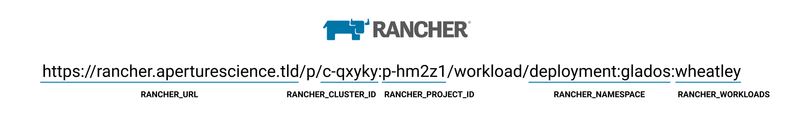

`rancher-redeploy-workload` is a docker image that redeploys a kubernetes workloads using Rancher's API.

## Running 



### Running as a Github action

```yaml
  - name: Update rancher deployment
    uses: th0th/rancher-redeploy-workload@v0.6
    env:
      RANCHER_BEARER_TOKEN: ${{ secrets.RANCHER_BEARER_TOKEN }}
      RANCHER_CLUSTER_ID: 'c-qxyky'
      RANCHER_NAMESPACE: 'namespace'
      RANCHER_PROJECT_ID: 'p-hm2z1'
      RANCHER_URL: 'https://rancher.aperturescience.tld'
      RANCHER_WORKLOADS: 'wheatley1,wheatley2'
      RANCHER_DOCKER_REGISTRY: 'private-docker-registry.com'
      UPDATE_IMAGES:'registry.docker.com/test/rancher-redeploy-workload:sha-5de12we'
```

### Running as a docker container

```shell script
$ docker run --rm -it \
    -e RANCHER_BEARER_TOKEN="token-xgskl:n45p7tmd47t9lfzh7xl8rw6rvtrfzzxrtdr6qvjg27r4sjcxvzss7d" \
    -e RANCHER_CLUSTER_ID="c-qxyky" \
    -e RANCHER_NAMESPACE="namespace" \
    -e RANCHER_PROJECT_ID="p-hm2z1" \
    -e RANCHER_URL="https://rancher.aperturescience.tld" \
    -e RANCHER_WORKLOADS="wheatley1,wheatley2" \
    -e RANCHER_DOCKER_REGISTRY='private-docker-registry.com' \
    -e UPDATE_IMAGES='registry.docker.com/test/rancher-redeploy-workload:sha-5de12we'
    th0th/rancher-redeploy-workload:v0.6
```

##无耻的插头

我是一个独立的黑客，并且正在运行一个名为[WebGazer] （https://www.webgazer.io）的正常运行时间监视和分析平台。您可能想检查一下是否正在运行在线业务，并想在客户面前注意到这些事件。

## License

Copyright © 2020, Gökhan Sarı. Released under the [MIT License](LICENSE).
